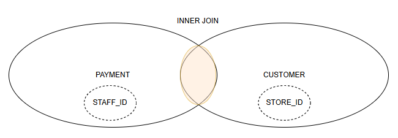
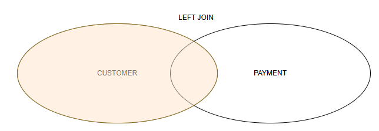
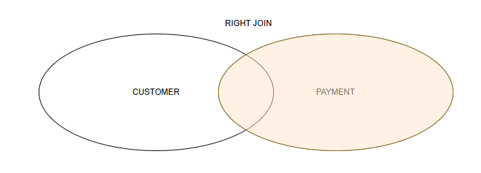
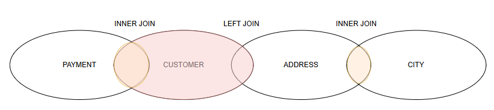

# 🔗 JOIN in SQL

## ✅ Cos'è una JOIN

La `JOIN` serve a **combinare righe da più tabelle** in base a una condizione di relazione tra colonne.

---

## 🔹 Tipi principali di JOIN

### 🔸 INNER JOIN
Restituisce solo le righe **corrispondenti** tra le due tabelle.



```sql
SELECT *
FROM customer c
INNER JOIN rental r ON c.customer_id = r.customer_id;
```


---


#### 🔹 LEFT JOIN

Una `LEFT JOIN` restituisce **tutte** le righe della tabella di sinistra. Se non trova corrispondenza nella tabella di destra, i valori di quest’ultima vengono riempiti con `NULL`.



```sql
SELECT COUNT(DISTINCT film.film_id) 
FROM film
LEFT JOIN inventory ON film.film_id = inventory.film_id
LEFT JOIN rental ON inventory.inventory_id = rental.inventory_id
WHERE rental_id IS NULL;
```

---

#### 🔹 RIGHT JOIN

Una `RIGHT JOIN` restituisce **tutte** le righe della tabella di destra. Se non trova corrispondenza nella tabella di sinistra, i valori di quest’ultima vengono riempiti con `NULL`.



```sql
SELECT film.film_id, rental_id, customer.first_name, customer.last_name 
FROM film
LEFT JOIN inventory ON film.film_id = inventory.film_id
LEFT JOIN rental ON inventory.inventory_id = rental.inventory_id
LEFT JOIN customer ON rental.customer_id = customer.customer_id
WHERE inventory.inventory_id IS NULL;
```

---

### ⚠️ Attenzione alle JOIN multiple

Quando una query utilizza **più JOIN concatenate**, è importante ricordare che **basta una sola INNER JOIN** nel mezzo per **"interrompere"** l’effetto di una LEFT JOIN precedente, causando la perdita di righe **a sinistra**.


---

## 🧠 Nota
È necessario specificare **la tabella da insieme al nome della colonna**, specialmente se hanno lo stesso nome in entrambe le tabelle.

---

# 🧪 Esercizi su JOIN

## 🔹 Esercizio 1 — da svolgere insieme

**Obiettivo**: Elenca tutti i clienti (`customer`) e la data del loro primo noleggio (`rental`).

```sql
SELECT c.first_name, c.last_name, MIN(r.rental_date) AS primo_noleggio
FROM customer c
JOIN rental r ON c.customer_id = r.customer_id
GROUP BY c.customer_id;
```

---

## ✍️ Esercizio 2 — prova tu

**Obiettivo**: Elenca i titoli dei film (`film`) e la categoria (`category`) a cui appartengono.

```sql
-- Suggerimento: servono le tabelle film, film_category e category
```

---

## ✍️ Esercizio 3 — prova tu

**Obiettivo**: Mostra l’elenco dei pagamenti (`payment`) effettuati da ciascun cliente (`customer`), con nome e cognome del cliente.

```sql
-- Suggerimento: JOIN tra payment e customer
```