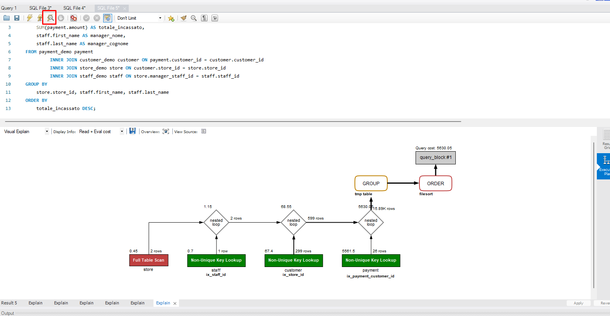

# Ottimizzazione delle query

#### 1 - Clonazione tabelle

```sql
CREATE TABLE payment_demo AS SELECT * FROM payment;
CREATE TABLE customer_demo AS SELECT * FROM customer;
CREATE TABLE store_demo AS SELECT * FROM store;
CREATE TABLE staff_demo AS SELECT * FROM staff;
```

#### 2 - Query non ottimizzata

```sql

SELECT 
    s.store_id,
    SUM(p.amount) AS totale_incassato,
    st.first_name AS manager_nome,
    st.last_name AS manager_cognome
FROM payment_demo p
INNER JOIN customer_demo c ON p.customer_id = c.customer_id
INNER JOIN store_demo s ON c.store_id = s.store_id
INNER JOIN staff_demo st ON s.manager_staff_id = st.staff_id
GROUP BY 
    s.store_id, st.first_name, st.last_name
ORDER BY 
    totale_incassato DESC
LIMIT 1;


```

#### 3 - Esecuzione di Explain

```sql
EXPLAIN
SELECT 
    store.store_id,
    SUM(payment.amount) AS totale_incassato,
    staff.first_name AS manager_nome,
    staff.last_name AS manager_cognome
FROM payment_demo payment
INNER JOIN customer_demo customer ON payment.customer_id = customer.customer_id
INNER JOIN store_demo store ON customer.store_id = store.store_id
INNER JOIN staff_demo staff ON store.manager_staff_id = staff.staff_id
GROUP BY 
    store.store_id, staff.first_name, staff.last_name
ORDER BY 
    totale_incassato DESC
LIMIT 1;
```

#### 4 - Esecuzione di Visual Explain (con MySQL WorkBench)

Riporta la query sopra presentata (senza `EXPLAIN`) e premi il pulsante con il fulmine e la lente: 



Viene in seguito rappresentato il piano di esecuzione della query, e per ciascuno step, in maniera visuale, lo strumento ci mostra il livello di performance.

#### 5 - Aggiungiamo INDICI O CHIAVI alle tabelle

```sql

CREATE INDEX ix_store_id ON customer_demo (store_id);
CREATE INDEX ix_manager_staff_id ON store_demo (manager_staff_id);
CREATE INDEX ix_staff_id ON staff_demo (staff_id);
CREATE INDEX ix_payment_customer_id ON payment_demo (customer_id);
CREATE INDEX ix_amount_customer_id ON payment_demo (amount);

ANALYZE TABLE store;

OPTIMIZE TABLE store_demo;

```
